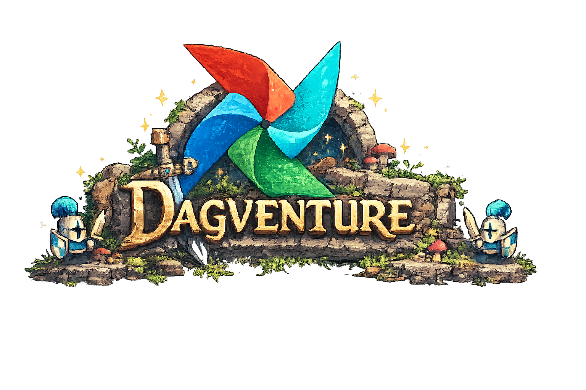
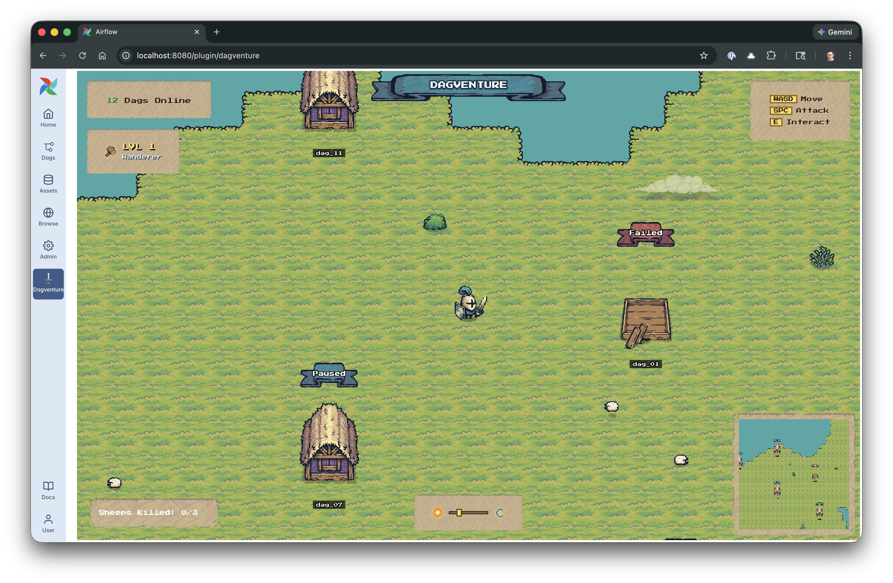
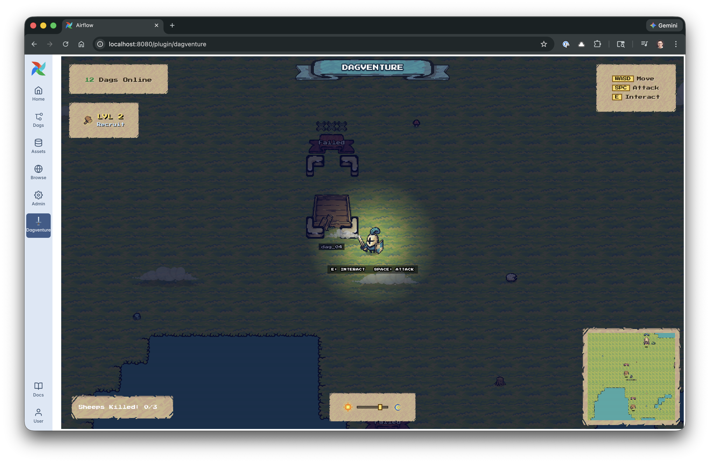
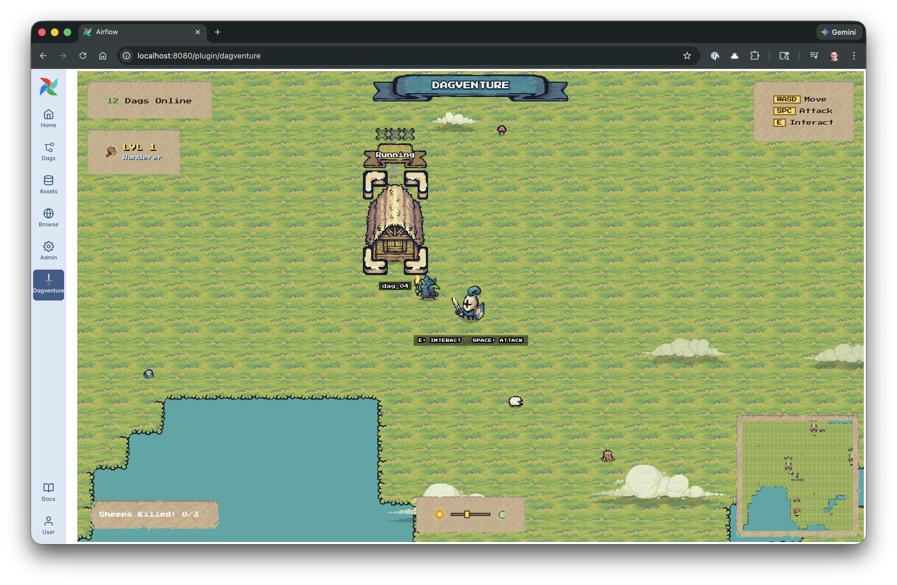
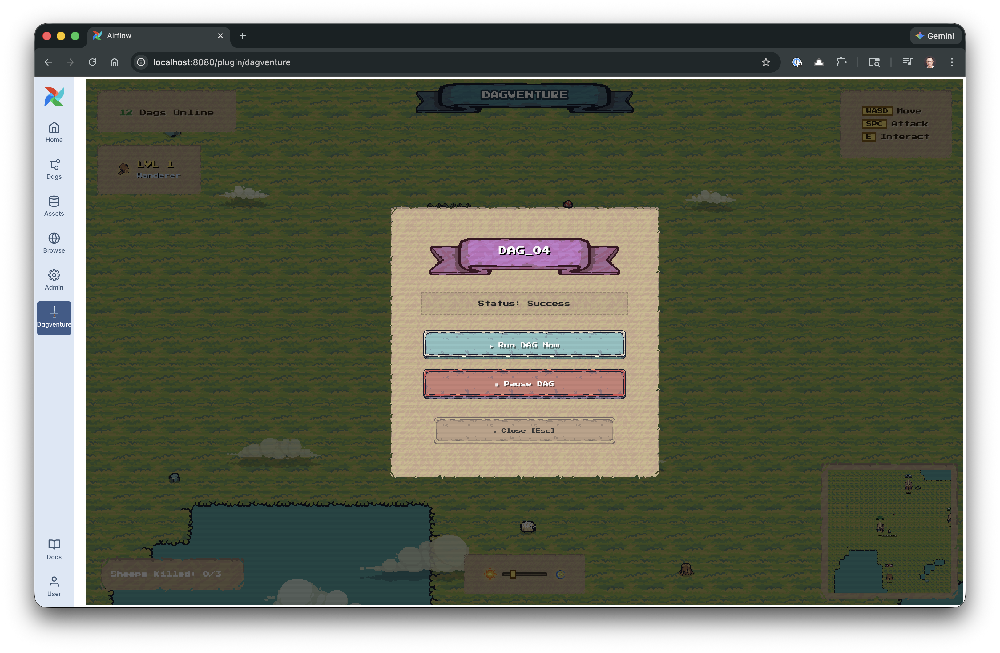
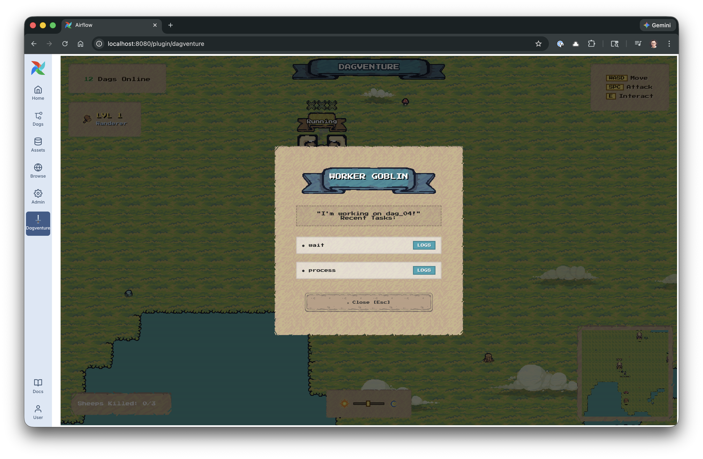
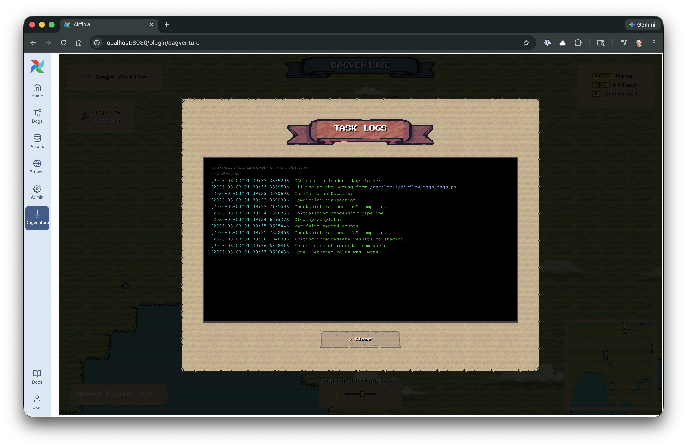

# Dagventure

<p align="center">
  
</p>

An Airflow 3 plugin that turns your Dag list into a playable pixel-art world. Every active Dag becomes a building on a procedurally generated island. Walk your knight around, trigger pipeline runs, read task logs, pause workflows, and destroy broken pipelines with a sword.

<p align="center">
  
</p>

```
[ Browser: Phaser 3 game ]
          │
          │ HTTP/JSON — relative paths, same-origin session auth
          ▼
[ Airflow API Server: FastAPI plugin ] ──▶ serves game.html + assets
          │
          │ plugin also proxies log requests (requests library)
          ▼
[ Airflow REST API v2 ] ──▶ [ Airflow Metadata DB ]
```

---

## Table of Contents

1. [Prerequisites](#prerequisites)
2. [Installation](#installation)
3. [Controls](#controls)
4. [Screenshots](#screenshots)
5. [How Airflow 3 Plugins Work](#how-airflow-3-plugins-work)
6. [How the Frontend Communicates with Airflow](#how-the-frontend-communicates-with-airflow)
7. [How Phaser 3 Works — A Beginner's Guide](#how-phaser-3-works--a-beginners-guide)
8. [How the Procedural Map is Generated](#how-the-procedural-map-is-generated)
9. [Architecture: File by File](#architecture-file-by-file)
10. [Game Mechanics in Depth](#game-mechanics-in-depth)
11. [Visual Effects](#visual-effects)
12. [The Backend: dagventure.py Explained](#the-backend-dagventurepy-explained)
13. [API Reference](#api-reference)
14. [Asset Credits](#asset-credits)

---

## Prerequisites

- **Airflow 3.x** (tested on Astro Runtime based on Airflow 3). This plugin uses APIs that are not available in Airflow 2.x.
- Python 3.12+
- The `apache-airflow-client` Python package (for the log proxy endpoint)
- The Tiny Swords pixel art asset pack (included in `plugins/assets/`)

---

## Installation

### 1. Copy the plugin directory

Copy the entire `plugins/` directory into the `plugins/` folder of your Airflow / Astro project. The assets are bundled inside `plugins/assets/`, so there is nothing else to copy.

```
your-airflow-project/
├── dags/
├── plugins/
│   ├── dagventure.py          ← plugin entry point
│   ├── assets/                   ← pixel art assets (bundled)
│   └── static/                   ← JS, CSS, HTML
└── ...
```

### 2. Restart the API server

```bash
# Local Astro development environment
astro dev restart

# Plain Airflow (Docker Compose)
docker compose restart airflow-webserver airflow-apiserver
```

Airflow auto-discovers plugins: any `.py` file in `plugins/` that defines an `AirflowPlugin` subclass is loaded automatically. No extra config required.

### 3. Open the game

After restart, a **"Dagventure"** entry appears in the Airflow navigation bar. Click it, or go directly to:

```
http://localhost:8080/dagventure/game
```

The game loads your live Dag list and builds the world. If the API is unreachable (e.g. running the HTML file outside Airflow), a demo world with 15 placeholder Dags is shown instead.

---

## Controls

| Key | Action |
|-----|--------|
| `WASD` / Arrow keys | Move the knight |
| `E` | Interact — opens the Dag menu when near a building, or talks to the goblin worker when the Dag is running |
| `Space` | Attack — deals 1 HP to the nearest building or sheep within range |
| `ESC` | Close log modal (first press), then close Dag menu (second press) |

---

## Screenshots

<p align="center">
  
  &nbsp;
  
</p>
<p align="center">
  <em>The procedurally generated island world (day) &nbsp;·&nbsp; Dynamic lighting at night — the player's torch cuts through the darkness</em>
</p>

<p align="center">
  
  &nbsp;
  
</p>
<p align="center">
  <em>Corner brackets pulse when you're close enough to interact &nbsp;·&nbsp; Trigger a run, pause, or unpause from the Dag menu</em>
</p>

<p align="center">
  
  &nbsp;
  
</p>
<p align="center">
  <em>Talk to the goblin worker to inspect running tasks &nbsp;·&nbsp; Syntax-highlighted Airflow task logs</em>
</p>

---

## How Airflow 3 Plugins Work

If you are new to Airflow plugins, this section explains the full picture from scratch.

### What is a plugin?

A plugin is a Python file (or package) you drop in the `plugins/` folder of your Airflow project. When Airflow starts, it scans that folder and imports every `.py` file it finds. If the file defines a class that inherits from `AirflowPlugin`, Airflow loads it automatically. No extra config, no pip install, no restart script — just copy the file.

Airflow 3 added a first-class feature: a plugin can register a **FastAPI application** that runs *inside* the Airflow API server process. That means your plugin gets a real HTTP server at a custom URL path, with zero extra infrastructure.

### The plugin class

Every plugin is identified by a class like this:

```python
from airflow.plugins_manager import AirflowPlugin
from fastapi import FastAPI

app = FastAPI()

@app.get("/hello")
async def hello():
    return {"message": "Hello from my plugin!"}

class MyPlugin(AirflowPlugin):
    name = "my_plugin"          # must be unique across all plugins, snake_case

    fastapi_apps = [{
        "app": app,
        "url_prefix": "/my-plugin",   # all routes live under this prefix
        "name": "My Plugin",
    }]

    external_views = [{
        "name":        "My Plugin",    # label shown in the Airflow nav bar
        "href":        "my-plugin/hello",  # NO leading slash — this is critical
        "destination": "nav",
        "url_route":   "my-plugin",
    }]
```

Airflow mounts the FastAPI app at `/my-plugin`. Your route `/hello` becomes `/my-plugin/hello`. The `external_views` entry adds a clickable link to the Airflow navigation bar that points to that URL.

### Why `href` must never have a leading slash

On Astronomer's managed Astro platform, the Airflow API server sits behind a reverse proxy that adds its own URL prefix. If you write `href: "/my-plugin/hello"`, the browser will navigate to exactly `/my-plugin/hello` — ignoring the proxy prefix — and get a 404.

If you write `href: "my-plugin/hello"` (no leading slash), the browser resolves the URL relative to the current Airflow base, which works whether you're running locally, on Astro, or on any other deployment.

The same rule applies to every resource loaded from `game.html`:

```html
<!-- WRONG — breaks on Astro -->
<script src="/dagventure/static/scene.js"></script>

<!-- CORRECT — works locally and on Astro -->
<script src="static/scene.js"></script>
```

### Authentication

The plugin inherits the Airflow session. A user who has already logged into the Airflow UI is automatically authenticated when the game makes API calls — the browser sends the session cookie automatically on every same-origin `fetch()`. No custom JWT, no API key, no extra headers needed.

---

## How the Frontend Communicates with Airflow

### All calls go through the plugin backend

The game frontend never talks to Airflow's API server directly. Every call goes to the plugin's own endpoints, which then call Airflow internally using the `apache-airflow-client` Python library with a cached JWT token. This gives the plugin control over the response shape — normalizing state enums, reformatting structured log output, etc.

```javascript
// In api.js
const BASE = 'api';  // relative URL — resolves to /dagventure/api/

async function getDags(limit = 100) {
  const response = await fetch(`${BASE}/dags?limit=${limit}`);
  if (!response.ok) throw new Error(`getDags failed: ${response.status}`);
  return response.json();
}
```

The browser fetches `/dagventure/api/dags`. The plugin backend handles that request, calls Airflow, and returns a normalized JSON response.

### Task logs: structured log parsing

The log endpoint does more work than the others. The frontend calls:

```javascript
await fetch(`api/dags/${dagId}/runs/${runId}/tasks/${taskId}/logs/${tryNumber}`)
```

The plugin backend receives this, fetches the raw JSON from Airflow's log endpoint with `requests`, parses the `StructuredLogMessage` list, and returns clean plain text:

```python
# In dagventure.py
url = f"{AIRFLOW_HOST}/api/v2/dags/{dag_id}/dagRuns/{run_id}/taskInstances/{task_id}/logs/{try_number}"
resp = requests.get(url, headers={"Authorization": f"Bearer {token}", "Accept": "application/json"})
data = resp.json()
messages = data.get("content", data)
lines = [f"[{msg['timestamp']}] {msg['event']}" for msg in messages if msg.get('event')]
return "\n".join(lines)
```

Airflow 3 uses **structured logging**: instead of returning a plain text file, the log endpoint returns a JSON list of `StructuredLogMessage` objects, each with an `event` (the message text) and a `timestamp`. The backend formats these into readable lines before sending them to the game.

### The plugin API routes

| Method | Path | What it does |
|--------|------|-------------|
| `GET` | `/dagventure/game` | Serves `game.html` |
| `GET` | `/dagventure/static/*` | Serves JS/CSS files |
| `GET` | `/dagventure/assets/*` | Serves pixel art assets |
| `GET` | `/dagventure/api/dags` | Lists Dags (proxied from Airflow) |
| `GET` | `/dagventure/api/dags/{id}/runs` | Lists Dag runs |
| `GET` | `/dagventure/api/dags/{id}/runs/{run}/tasks` | Lists task instances |
| `GET` | `/dagventure/api/dags/{id}/runs/{run}/tasks/{task}/logs/{n}` | Task log (formatted) |
| `POST` | `/dagventure/api/dags/{id}/trigger` | Triggers a new run |
| `PATCH` | `/dagventure/api/dags/{id}/pause` | Pauses or unpauses |
| `DELETE` | `/dagventure/api/dags/{id}` | Deletes a Dag |

### State normalization

Airflow has many internal task states (`queued`, `scheduled`, `deferred`, `up_for_retry`, `upstream_failed`, ...). The game only cares about a small set. The normalization happens in `_fetchDags()` in `scene.js`:

```javascript
let state;
if (rawDag.is_paused) {
    state = 'paused';
} else if (!latestRun) {
    state = 'never_run';
} else {
    state = latestRun.state || 'never_run';  // use Airflow's state directly
}
```

These normalized states then drive building appearance:

| State | Building color | Goblin worker? |
|-------|---------------|----------------|
| `success` | Blue | No |
| `running` | Yellow | Yes — spawns next to building |
| `failed` | Construction site | No |
| `paused` | Purple | No |
| `queued` | Construction site | No |
| `never_run` | Blue | No |

---

## How Phaser 3 Works — A Beginner's Guide

If you have never used a game framework before, this section explains the core concepts used in this project.

### What is Phaser?

Phaser is a JavaScript game framework that runs in the browser. It handles:
- Rendering (drawing sprites, backgrounds, text) via WebGL or Canvas
- Physics (collision detection, velocity, gravity)
- Input (keyboard, mouse, touch)
- Asset loading (images, spritesheets, audio)
- Animations (cycling through frames of a spritesheet)
- Cameras (viewport, zoom, follow)

Dagventure loads Phaser from a CDN — there is no build step, no `npm install`, no bundler.

### The game loop

Every Phaser game has three core lifecycle methods that you override:

```javascript
class GameScene extends Phaser.Scene {

  preload() {
    // Called once at startup.
    // Load all assets (images, spritesheets, audio) here.
    // Phaser queues the downloads and won't call create() until they're all done.
    this.load.image('water', 'assets/terrain/water/water.png');
    this.load.spritesheet('warrior', 'assets/.../warrior_blue.png', {
      frameWidth: 192, frameHeight: 192
    });
  }

  create() {
    // Called once after all assets are loaded.
    // Create game objects (sprites, physics bodies, cameras, animations).
    // Wire up input handlers.
    this.player = this.physics.add.sprite(100, 100, 'warrior');
    this.player.play('p_idle');
  }

  update() {
    // Called every frame (~60 times per second).
    // Move things, check input, update depths, animate water.
    if (this.cursors.left.isDown) {
        this.player.setVelocityX(-280);
    }
  }
}
```

### Spritesheets and animations

A spritesheet is a single image file that contains multiple animation frames laid out in a grid. Instead of loading 8 separate PNG files for a walking animation, you load one file and tell Phaser the frame dimensions:

```javascript
// Load: tell Phaser how to slice the image into frames
this.load.spritesheet('warrior', 'warrior_blue.png', {
  frameWidth: 192,
  frameHeight: 192
});

// Create animation: define which frames to play and how fast
this.anims.create({
  key: 'p_walk',
  frames: this.anims.generateFrameNumbers('warrior', { start: 6, end: 11 }),
  frameRate: 12,
  repeat: -1,  // -1 means loop forever
});

// Play animation on a sprite
this.player.play('p_walk');
```

The warrior spritesheet (`warrior_blue.png`) is a 1152×1536 image with 6 columns and 8 rows of 192×192 frames. Row 0 (frames 0–5) is the idle animation, row 1 (frames 6–11) is walking, row 2 (frames 12–17) is attacking.

### Physics

Phaser's Arcade Physics engine handles movement and collision. There are two kinds of physics bodies:

- **Dynamic bodies** — can move, are affected by velocity and collisions (the player, sheep, goblin workers)
- **Static bodies** — never move, but block dynamic bodies (water tiles, trees, buildings)

```javascript
// Dynamic sprite — can move
this.player = this.physics.add.sprite(x, y, 'warrior');
this.player.setVelocity(280, 0);  // move right at 280 pixels/second

// Static group — immovable obstacles
this.obstacles = this.physics.add.staticGroup();
this.obstacles.create(x, y, null).setVisible(false).body.setSize(64, 64);

// Wire up collision — player bounces off obstacles
this.physics.add.collider(this.player, this.obstacles);
```

**Why hitboxes are smaller than sprites:**
The game uses a top-down perspective with sprites that look like they're viewed at an angle (the "2.5D pixel-art look"). The warrior sprite is 192×192 pixels, but visually the character's feet are near the bottom of the frame. If the hitbox covered the full 192×192 area, the player would collide with things that are visually above them (trees, building rooftops). Instead, hitboxes only cover the "feet" area:

```javascript
// Player hitbox: 32×16 pixels, offset to sit at the warrior's feet
this.player.body.setSize(32, 16).setOffset(80, 170);
```

**The `refreshBody()` gotcha:**
When you call `setScale()` or `setOrigin()` on a static body, Phaser does *not* automatically recalculate the physics body position. You must call `refreshBody()` explicitly, otherwise the invisible collision box will be in the wrong place:

```javascript
const tree = this.obstacles.create(x, y, 'tree', frame)
  .setOrigin(0.5, 1)
  .setScale(0.8);
tree.body.setSize(32, 32).setOffset(61, 122);
tree.refreshBody();  // ← required after setOrigin/setScale on static bodies
```

### Cameras

Phaser supports multiple cameras looking at the same game world simultaneously. This project uses two:

1. **Main camera** — follows the player with a small lag (0.1 lerp factor), covers the full screen
2. **Minimap camera** — a small 200×200 viewport in the bottom-right corner, zoomed out to 12%

```javascript
// Main camera follows the player
this.cameras.main
  .setBounds(0, 0, worldWidth, worldHeight)
  .startFollow(this.player, true, 0.1, 0.1);  // lerp X=0.1, Y=0.1 for smooth follow

// Minimap camera: positioned at bottom-right, very zoomed out
this.minimap = this.cameras
  .add(window.innerWidth - 220, window.innerHeight - 220, 200, 200)
  .setZoom(0.12)
  .setBounds(0, 0, worldWidth, worldHeight)
  .startFollow(this.player);

// Tell the minimap to ignore certain objects (so they don't render twice)
this.minimap.ignore(this.miniFrame);   // the decorative frame
this.minimap.ignore(this.clouds);       // clouds don't appear on minimap
```

### Depth sorting (Y-sort)

In a 2D top-down game, objects that are "lower" on the screen (higher Y coordinate) should appear in front of objects that are "higher" (lower Y). This creates the illusion of depth. The technique is called Y-sorting.

Phaser renders objects in order of their `depth` property. We set each moving object's depth equal to its Y position every frame:

```javascript
update() {
  this.player.setDepth(this.player.y);
  this.sheeps.forEach(s => s.sprite.setDepth(s.sprite.y));
}
```

Static objects (buildings, trees, decorations) have their depth set once at creation time since they never move.

### The NineSlice for UI panels

Pixel-art UI panels need to scale without distorting the corners (which have decorative detail). Phaser's `NineSlice` object divides an image into a 3×3 grid: the four corners are never scaled, the four edges stretch along one axis only, and the center stretches in both directions.

```javascript
// 9-slice panel: 230×230, with 32-pixel insets on all sides
this.add.nineslice(x, y, 'minimap_frame', null, 230, 230, 32, 32, 32, 32);
```

This allows the chat bubble above each building to grow and shrink based on text length without distorting the ribbon graphic.

---

## How the Procedural Map is Generated

The map is generated fresh every time the game loads (or when the Dag count changes). The process happens entirely in `map-generator.js` and uses no external libraries.

### Step 1: Size the grid

The map is a 2D grid of cells, each 64×64 pixels. The grid starts as all water (every cell = `0`). Its dimensions scale with the number of Dags:

```javascript
const islandsCount = Math.max(1, Math.ceil(numDags / 3));
this.cols = 60 + islandsCount * 12;
this.rows = 40 + islandsCount * 8;
this.grid = Array.from({ length: this.rows }, () => Array(this.cols).fill(0));
```

For 12 Dags: 4 islands, 108 columns × 72 rows → a 6912×4608 pixel world.

### Step 2: Place island blobs

For each island, a random center point and radius are chosen. Then every grid cell near that center is tested: if it's close enough to the center, it becomes land (`1`).

The "close enough" check uses a small noise function to make the island edge irregular instead of a perfect circle:

```javascript
drawBlob(cx, cy, r) {
  for (let row = cy - r - 3; row <= cy + r + 3; row++) {
    for (let col = cx - r - 3; col <= cx + r + 3; col++) {
      const dx   = col - cx;
      const dy   = row - cy;
      const dist = Math.sqrt(dx * dx + dy * dy);

      // sine+cosine noise: shifts the effective radius by up to ±2 cells
      // depending on the cell's coordinates — creates a jagged, organic edge
      const noise = (Math.sin(col * 0.4) + Math.cos(row * 0.4)) * 2;

      if (dist + noise < r) {
        this.grid[row][col] = 1;  // mark as land
      }
    }
  }
}
```

The noise term `(sin(x * 0.4) + cos(y * 0.4)) * 2` oscillates slowly across the grid. When the noise is positive, cells at the edge of the radius are excluded (island shrinks locally). When negative, cells just outside the radius are included (island bulges). The result looks like a natural island shape rather than a circle.

### Step 3: Draw bridges

Islands are connected in sequence (island 0 → 1, 1 → 2, etc.) by drawing a bridge between each pair. A bridge is just a series of small blobs placed along a straight line between two island centers:

```javascript
drawBridge(islandA, islandB) {
  const steps = 25;
  for (let i = 0; i <= steps; i++) {
    const t = i / steps;  // goes from 0.0 to 1.0
    const x = Math.floor(Phaser.Math.Linear(islandA.cx, islandB.cx, t));
    const y = Math.floor(Phaser.Math.Linear(islandA.cy, islandB.cy, t));
    this.drawBlob(x, y, 4);  // radius-4 blob at each point along the line
  }
}
```

`Phaser.Math.Linear(a, b, t)` returns `a + (b - a) * t` — it linearly interpolates between two values. By stepping `t` from 0 to 1 in 25 increments and drawing a small blob at each point, you get a continuous land bridge.

### Step 4: Pick edge/corner tile frames

Once the grid is filled, `scene.js` renders it by checking each land cell's four immediate neighbors. Depending on which sides are water vs. land, a different tile frame is chosen:

```javascript
const hasUp    = this.gen.getTile(row - 1, col) === 1;
const hasDown  = this.gen.getTile(row + 1, col) === 1;
const hasLeft  = this.gen.getTile(row, col - 1) === 1;
const hasRight = this.gen.getTile(row, col + 1) === 1;

let tileFrame = 11;  // default: fully surrounded interior tile
if      (!hasUp   && !hasLeft)  tileFrame = 0;   // top-left corner
else if (!hasUp   && !hasRight) tileFrame = 2;   // top-right corner
else if (!hasDown && !hasLeft)  tileFrame = 20;  // bottom-left corner
else if (!hasDown && !hasRight) tileFrame = 22;  // bottom-right corner
else if (!hasUp)                tileFrame = 1;   // top edge
else if (!hasDown)              tileFrame = 21;  // bottom edge
else if (!hasLeft)              tileFrame = 10;  // left edge
else if (!hasRight)             tileFrame = 12;  // right edge
```

The ground tilemap spritesheet (`tilemap_flat.png`) is a 10×4 grid of 64×64 tiles. Frame numbers increase left-to-right, top-to-bottom (frame 0 = top-left tile, frame 11 = center of top row, etc.).

### Step 5: Select building placement spots

`getLandSpots(count)` collects all land cells at least 4 cells from the map edge, shuffles them randomly, then picks spots that are at least 7 cells apart from each other:

```javascript
getLandSpots(count) {
  const candidates = [];
  for (let r = 4; r < this.rows - 4; r++) {
    for (let c = 4; c < this.cols - 4; c++) {
      if (this.grid[r][c] === 1) candidates.push({ c, r });
    }
  }

  Phaser.Utils.Array.Shuffle(candidates);  // randomize order

  const selected = [];
  for (const spot of candidates) {
    if (selected.length >= count) break;
    const isFarEnough = selected.every(
      existing => Math.abs(existing.c - spot.c) > 7 || Math.abs(existing.r - spot.r) > 7
    );
    if (isFarEnough) selected.push(spot);
  }
  return selected;
}
```

The minimum-distance check prevents buildings from overlapping or being placed side-by-side. `_initWorld()` requests `dags.length + 51` spots: one for the player spawn, one per Dag, and 50 extras buffered so new Dags that appear between world rebuilds can be placed without regenerating the entire map.

---

## Architecture: File by File

```
plugins/
├── dagventure.py       ← FastAPI app + AirflowPlugin registration
├── assets/                ← Pixel art (served at /dagventure/assets/)
│   ├── factions/knights/  ← Player sprite, building sprites
│   ├── factions/goblins/  ← Goblin worker sprite
│   ├── terrain/           ← Ground tiles, water, pixel-art clouds (01–08)
│   ├── resources/         ← Trees, sheep
│   ├── effects/           ← Explosion animation
│   ├── ui/                ← Banners, ribbons, buttons, icons, pointers
│   └── deco/              ← Decorative objects 01–18, bushes (bushe1–4), rocks (rock1–4)
└── static/                ← Frontend (served at /dagventure/static/)
    ├── game.html          ← Entry point — loads Phaser CDN + scripts in order
    ├── constants.js       ← Shared constants and state lookup tables
    ├── api.js             ← AirflowApi wrapper (all fetch calls)
    ├── map-generator.js   ← MapGenerator class — procedural island generation
    ├── entities.js        ← DagBuilding, ChatBubble, Sheep classes
    ├── scene.js           ← GameScene — the Phaser scene (preload/create/update)
    ├── ui.js              ← DOM bridge functions + Phaser.Game boot
    └── game.css           ← HUD, menus, pixel-art panels
```

### Script loading order

Scripts are loaded in dependency order because they share globals — there is no bundler or module system. Each script must be loaded before the scripts that depend on it:

```html
    <script src="static/constants.js"></script>    <!-- PF, PLAYER_SPEED, STATE_* maps -->
<script src="static/api.js"></script>           <!-- AirflowApi -->
<script src="static/map-generator.js"></script> <!-- MapGenerator -->
<script src="static/entities.js"></script>      <!-- DagBuilding, ChatBubble, Sheep -->
<script src="static/scene.js"></script>         <!-- GameScene -->
<script src="static/ui.js"></script>            <!-- openMenu, viewLog, boots Phaser.Game -->
```

### `constants.js` — shared lookup tables

Defines global constants used across all other files:

```javascript
const PF = { fontFamily: "'Press Start 2P', monospace", resolution: 3 };
const PLAYER_SPEED = 280;
const INTERACT_RADIUS = 140;

const STATE_RIBBON = {
  success: 'ribbon_blue',
  running: 'ribbon_yellow',
  failed:  'ribbon_red',
  // ...
};

const LEVEL_NAMES = {
  1: 'Wanderer', 2: 'Recruit',  3: 'Soldier',  4: 'Knight',
  5: 'Guardian', 6: 'Champion', 7: 'Hero',      8: 'Warlord',
  9: 'Legend',  10: 'MAX RANK',
};
```

`getSpriteForDag(dag)` is also here — it maps a Dag's tags and state to the correct building texture key:

```javascript
function getSpriteForDag(dag) {
  let buildingType = 'house';
  if (dag.tags.includes('critical') || dag.dag_id.includes('prod')) buildingType = 'castle';
  else if (dag.dag_id.includes('sync') || dag.dag_id.includes('etl')) buildingType = 'tower';

  if (dag.state === 'failed') return `${buildingType}_construction`;

  let color = 'blue';
  if (dag.is_paused)           color = 'purple';
  else if (dag.state === 'running') color = 'yellow';

  return `${buildingType}_${color}`;  // e.g. "house_yellow", "castle_construction"
}
```

### `api.js` — the Airflow API wrapper

All HTTP calls to the plugin backend live in one place. The `BASE` constant is a relative path that resolves correctly on any deployment:

```javascript
const AirflowApi = (() => {
  const BASE = 'api';  // resolves to /dagventure/api/

  async function getDags(limit = 100) {
    const response = await fetch(`${BASE}/dags?limit=${limit}`);
    if (!response.ok) throw new Error(`getDags failed: ${response.status}`);
    return response.json();
  }
  // ...
  return { getDags, getDagRuns, getTaskInstances, getTaskLogs, triggerDag, setPaused, deleteDag };
})();
```

The module is wrapped in an IIFE (Immediately Invoked Function Expression) — the `(() => { ... })()` pattern. This keeps all the helper functions private and only exposes the public API through the returned object.

### `entities.js` — game objects

Contains three classes:

**`ChatBubble`** — a floating speech bubble above each building showing the Dag state. Built with a NineSlice ribbon and a text object:

```javascript
class ChatBubble extends Phaser.GameObjects.Container {
  constructor(scene, text, state) {
    super(scene, 0, 0);
    this._bg  = scene.add.nineslice(0, 0, ribbonKey, null, 100, 48, 24, 24, 20, 20);
    this._txt = scene.add.text(0, -4, text, { ...PF, fontSize: '10px', color: '#fff' });
    this.add([this._bg, this._txt]);
  }
}
```

**`DagBuilding`** — wraps a building sprite, its label, chat bubble, health hearts, and the four corner bracket indicators. Also owns the goblin worker sprite when the Dag is running, and manages smoke particle emitters. The corner brackets pulse with a sine tween using `scene.tweens.add()`.

**`Sheep`** — a wandering NPC. Uses a timer event (`scene.time.addEvent`) to periodically pick a random velocity and switch between idle and walk animations. If killed three times total, all Dags are deleted.

The module-level helper `_spawnDamageText(scene, x, y)` is shared by both `DagBuilding` and `Sheep` to avoid duplicating the floating `-1` animation logic.

### `scene.js` — the Phaser scene

`GameScene` extends `Phaser.Scene` and is the heart of the game. Key methods:

- **`preload()`** — loads all assets
- **`create()`** — sets up input handlers, starts the 10-second Dag polling timer, calls `_fetchDags()` immediately
- **`_fetchDags()`** — fetches all Dags + their latest runs in parallel, normalizes states, then either builds the world from scratch (first load) or updates existing buildings incrementally (subsequent polls)
- **`_initWorld(dags)`** — tears down and rebuilds the entire Phaser scene: generates the map, places tiles, spawns buildings, spawns the player and sheep, sets up cameras
- **`update()`** — called every frame: handles movement input, Y-sorts sprites, drifts clouds, finds the nearest building within interact range, advances the day/night cycle
- **`_repositionHud()`** — called from `update()` to keep screen-space UI anchored correctly on window resize
- **`_handleAttack()`** — deals damage to nearby buildings/sheep when Space is pressed
- **`_handleInteract()`** — opens the appropriate menu when E is pressed
- **`_initDayNight()` / `_updateDayNight()` / `_updateLightMask()`** — day/night cycle: compute overlay colour from cycle position, fill the `RenderTexture`, erase light holes at player and goblin positions
- **`_rebuildLightMask()`** — (re)creates the `RenderTexture` at the correct canvas size; called once on init and again whenever the browser window is resized
- **`_createLightTextures()`** — generates radial gradient canvas textures for the two light sizes
- **`_onDagSuccess()` / `_onLevelUp(level)`** — level progression: increments the success counter, checks for a rank-up, updates the HUD panel, triggers flash and toast
- **`showToast(msg, type)`** — shows a timed ribbon notification at the top of the screen

### `ui.js` — DOM bridge and log viewer

The game's menus and log panels are regular HTML/CSS elements, not Phaser objects. `ui.js` bridges the Phaser game world (JavaScript) with the DOM (HTML):

- **`openMenu(dag)`** — shows the Dag interaction panel with Trigger/Pause/Unpause buttons
- **`openConversation(dag)`** — shows the goblin dialogue panel with task instance list
- **`viewLog(dagId, runId, taskId, tryNumber)`** — fetches formatted log text, runs it through a custom `highlight.js` syntax highlighter that colors timestamps, log levels, error keywords, and Python file paths, then injects the highlighted HTML into the log modal
- Boots `new Phaser.Game(...)` after `document.fonts.ready` resolves (prevents the pixel font from flashing as a fallback font on the first frame)

---

## Game Mechanics in Depth

### The 10-second Dag polling loop

On load, `_fetchDags()` is called immediately. It's also scheduled to run every 10 seconds:

```javascript
this.time.addEvent({
  delay: 10000,
  loop: true,
  callback: this._fetchDags,
  callbackScope: this,
});
```

Each call fetches the full Dag list, then fires parallel requests for the latest run of each Dag:

```javascript
const runResults = await Promise.all(
  rawDags.map(dag => AirflowApi.getDagRuns(dag.dag_id))
);
```

`Promise.all` fires all the requests simultaneously and waits for all of them to complete. For 12 Dags this means 13 requests (1 for the list + 12 for runs) happen concurrently rather than one-at-a-time.

The response is then diffed against the current world state:
- If a Dag changed state → update the building's sprite and chat bubble
- If a Dag was deleted externally → destroy the building
- If a new Dag appeared → find a free spot from the pre-buffered spot list and place a new building

### Combat system

Pressing Space triggers the warrior's attack animation and scans for nearby targets:

```javascript
this.buildings.forEach(building => {
  const dist = Phaser.Math.Distance.Between(
    this.player.x, this.player.y,
    building.wx, building.wy - 20
  );
  if (dist < 120) building.takeDamage();
});
```

Buildings and sheep each have 3 HP, shown as heart icons (visible only when you're close or during combat). Three hits destroy a building, triggering an explosion animation and a `DELETE api/dags/{id}` call to the plugin backend (which then deletes the Dag from Airflow).

### The interaction radius and bracket indicators

Every frame in `update()`, the game finds the single nearest building (or goblin worker) within `INTERACT_RADIUS` (140 pixels) of the player:

```javascript
let nearestBuilding = null;
let nearestDistance = INTERACT_RADIUS;

this.buildings.forEach(building => {
  const dist = Phaser.Math.Distance.Between(player.x, player.y, building.wx, building.wy - 30);
  if (dist < nearestDistance) {
    nearestBuilding = building;
    nearestDistance = dist;
  }
});
```

Then `setNear(true/false)` is called on every building. The building that is nearest gets its four corner bracket sprites made visible and starts a looping pulse tween:

```javascript
this._bracketTween = this.scene.tweens.add({
  targets: this.corners,
  scale: { from: CORNER_BASE_SCALE, to: CORNER_PULSE_SCALE },
  duration: 700,
  yoyo: true,     // plays forward then backward
  repeat: -1,     // loops forever
  ease: 'Sine.easeInOut',
});
```

The corner sprites use `setOrigin()` set to their respective corner (top-left has origin 0,0; bottom-right has origin 1,1). When the scale increases, the image grows toward the center of the building — giving the "arms reaching inward" pulse effect.

### Knight level progression

Every successful Dag run advances the player's knight rank. The current level and rank name are shown in the top-left HUD panel, just below the Dag counter. Levels run from 1 (Wanderer) to 10 (MAX RANK), with a new title unlocking at each step.

When the 10-second polling loop detects a Dag transitioning into `success` state, it calls `_onDagSuccess()`:

```javascript
_onDagSuccess() {
  this.dagSuccessCount++;
  const newLevel = Math.min(10, this.dagSuccessCount + 1);
  if (newLevel > this._playerLevel) {
    this._playerLevel = newLevel;
    this._onLevelUp(newLevel);
  }
}
```

A level-up triggers three simultaneous feedback events:

1. **Toast banner** — `"LEVEL UP! LVL X — RankName"` using the blue ribbon style
2. **White screen flash** — `#level-flash` (a full-screen CSS overlay) fades in to 40% opacity then back to transparent over 0.4 seconds
3. **HUD pulse** — a `levelUpPulse` CSS animation scales the level panel from 1 → 1.3 → 1 over 600 ms

The HUD panel updates its text immediately:

```javascript
document.getElementById('level-text').textContent = `LVL ${level}`;
document.getElementById('level-name').textContent  = LEVEL_NAMES[level];
```

### Pixel-art clouds

Clouds use real pixel-art sprites from the Tiny Swords asset pack — eight variants loaded from `assets/terrain/clouds/clouds_01.png` through `clouds_08.png`. In `_createClouds()`, 60 cloud instances are scattered at random world positions, each picking a random variant:

```javascript
const key = Phaser.Utils.Array.GetRandom(
  ['cloud_01', 'cloud_02', 'cloud_03', 'cloud_04',
   'cloud_05', 'cloud_06', 'cloud_07', 'cloud_08']
);
const cloud = this.add.image(wx, wy, key)
  .setScale(0.5)
  .setAlpha(Phaser.Math.FloatBetween(0.55, 0.85))
  .setDepth(9000);
cloud.velX = Phaser.Math.FloatBetween(4, 12);
```

Each cloud has a `velX` drift speed. Every frame in `update()`, the position advances and wraps around when the cloud passes the right edge of the world, so the sky stays populated without ever running out of clouds. All cloud objects are added to `this.minimap.ignore()` so they don't clutter the minimap.

### Diagonal movement normalization

Without correction, moving diagonally (pressing W+D simultaneously) would be faster than moving straight — you'd be adding two full-speed velocity vectors. The game normalizes by multiplying by `1/√2 ≈ 0.707`:

```javascript
if (velocityX !== 0 && velocityY !== 0) {
  velocityX *= 0.707;
  velocityY *= 0.707;
}
```

This keeps the player's actual speed constant regardless of direction.

---

## Visual Effects

### Toast notifications for Dag state changes

Every time `_fetchDags()` runs, it compares the new Dag states against a cached snapshot from the previous poll (`_dagStateCache`). If any Dag just transitioned into `failed` or `success`, a toast banner appears:

```javascript
if (this._dagStateCache) {
  const changed = dags.filter(d => this._dagStateCache[d.dag_id] && this._dagStateCache[d.dag_id] !== d.state);
  const failed  = changed.find(d => d.state === 'failed');
  const success = changed.find(d => d.state === 'success');
  if (failed)       this.showToast(`${failed.dag_id} FAILED!`, 'danger');
  else if (success) this.showToast(`${success.dag_id} COMPLETE`, 'success');
}
this._dagStateCache = Object.fromEntries(dags.map(d => [d.dag_id, d.state]));
```

`showToast()` sets the `data-type` attribute on the `#toast` element, which CSS uses to pick the right ribbon color via attribute selectors. A `success` transition also calls `_onDagSuccess()`, which may trigger a knight level-up (see below).

### Floating damage numbers

Every time a building or sheep takes a hit, a `-1` text object is created at the impact point and animated upward while fading out:

```javascript
function _spawnDamageText(scene, x, y) {
  const tx  = x + Phaser.Math.Between(-16, 16);
  const txt = scene.add.text(tx, y, '-1', { ...PF, fontSize: '14px', color: '#ff3333', stroke: '#000000', strokeThickness: 4 })
    .setOrigin(0.5, 0.5).setDepth(y + 9999);
  scene.tweens.add({
    targets: txt, y: y - 55, alpha: 0, duration: 850, ease: 'Power2',
    onComplete: () => txt.destroy(),
  });
}
```

The `depth + 9999` ensures the text floats above everything else in the scene. Setting `ease: 'Power2'` makes the text start fast and decelerate, mimicking the physics of something being flung upward.

### Smoke particles over running Dags

When a Dag enters the `running` state, `_startSmoke()` creates a particle emitter above the building's chimney position. Particles are small grey pixels that rise, spread, and scale up as they fade out — simulating a smoke puff:

```javascript
this._smokeEmitter = this.scene.add.particles(this.wx, chimneyY, 'smoke_pixel', {
  speedY:   { min: -35, max: -65 },  // rises upward
  scale:    { start: 1.0, end: 4.5 }, // expands as it rises
  alpha:    { start: 0.85, end: 0 },  // fades out
  tint:     [0xdddddd, 0xcccccc, 0xbbbbbb, 0xaaaaaa],
  frequency: 200, quantity: 2,
});
```

The `smoke_pixel` texture is a 4×4 grey square generated at runtime via `Graphics.generateTexture()` — no image asset needed. When the Dag stops running, `_stopSmoke()` destroys the emitter.

### Day/night cycle and dynamic light sources

The game runs a 2.5-minute cycle that smoothly transitions from day through sunset, night, and back to dawn. This is implemented with a screen-space `RenderTexture` (`_lightMask`) rather than a DOM overlay, because it enables dynamic light sources.

**How the darkness overlay works:**

Every frame, `_updateLightMask()`:
1. Clears the `RenderTexture`
2. Fills it with the current night colour and alpha (both computed by `_updateDayNight(delta)` from the cycle position)
3. Calls `rt.erase()` at the screen position of each light source, punching a transparent hole through the darkness

```javascript
this._lightMask.clear();
this._lightMask.fill(hexColor, this._nightAlpha);

// Erase a circle of darkness around the player
const px = (this.player.x - cam.scrollX) + 200;
const py = (this.player.y - cam.scrollY) + 200;
this._lightMask.erase('light_lg', px - 150, py - 150);

// Smaller light for each goblin torch
this.buildings.forEach(b => {
  if (!b.worker) return;
  const wx = (b.worker.x - cam.scrollX) + 200;
  const wy = (b.worker.y - cam.scrollY) + 200;
  this._lightMask.erase('light_sm', wx - 90, wy - 90);
});
```

The light textures (`light_lg` at 300px, `light_sm` at 180px) are radial gradient canvases generated with the Canvas 2D API:

```javascript
const grad = ctx.createRadialGradient(r, r, 0, r, r, r);
grad.addColorStop(0,    'rgba(255,255,255,1.0)');  // fully transparent hole at center
grad.addColorStop(0.65, 'rgba(255,255,255,0.30)'); // soft falloff
grad.addColorStop(1,    'rgba(255,255,255,0.0)');  // darkness at the edge
```

When this white gradient is used with `rt.erase()`, it removes the corresponding amount of the darkness fill — creating a soft glowing light source effect.

**Why `setScrollFactor(0)` and the resize listener:**

The `RenderTexture` uses `setScrollFactor(0)` so it stays fixed to the screen even as the camera moves. The `+200` pixel offset compensates for the fact that the RT is positioned at `(-200, -200)` — a 200-pixel overflow margin on every side prevents edge clipping when the player is near the screen boundary.

Because Phaser's `Scale.RESIZE` mode lets the canvas grow or shrink when the browser window is resized, the `RenderTexture` must be recreated at the new size to avoid strips of unmasked darkness at the edges. This is handled by `_rebuildLightMask()`, which uses `this.scale.width` and `this.scale.height` (the actual canvas dimensions, not `window.innerWidth`), and is wired up via:

```javascript
this.scale.on('resize', this._rebuildLightMask, this);
```

**Phase timeline:**

| t range | Phase | Overlay colour |
|---------|-------|----------------|
| 0.00 – 0.30 | Day | None (invisible) |
| 0.30 – 0.45 | Sunset | Warm amber fade in |
| 0.45 – 0.55 | Dusk | Transition to deep blue |
| 0.55 – 0.70 | Night | Deep blue, max opacity |
| 0.70 – 0.80 | Dawn | Warm amber fade back |
| 0.80 – 0.95 | Sunrise | Amber fades to transparent |
| 0.95 – 1.00 | Day | Invisible again |

### Day/night time indicator (bottom HUD)

A bottom-centre panel shows where in the cycle the game currently is. A sun icon on the left represents day; a moon icon on the right represents night. A small gold square marker slides along the track between them:

```javascript
// markerPos: 0 = full day, 1 = full night
const markerPos = t <= 0.55 ? t / 0.55 : 1 - (t - 0.55) / 0.45;
document.getElementById('time-marker').style.left = `${(markerPos * 100).toFixed(1)}%`;
```

The panel uses the same `carved_9slides.png` CSS `border-image` as the other HUD panels for visual consistency. The sliding marker is a pure CSS element — a `10×14px` gold square (`#ffe066`) with a dark pixel-art border, positioned absolutely inside the flex track. No image asset needed for the marker.

Phase transition labels ("SUNSET APPROACHES...", "NIGHTFALL", "DAWN BREAKS") appear at `#time-label` below the bar for 3 seconds using `_showTimeLabel()`.

### Scanlines effect

A subtle scanline overlay is applied to the entire game using a CSS `::after` pseudo-element on `#root`:

```css
#root::after {
  content: '';
  position: absolute;
  inset: 0;
  background: repeating-linear-gradient(
    to bottom,
    transparent 0px,
    transparent 2px,
    rgba(0,0,0,0.04) 2px,
    rgba(0,0,0,0.04) 4px
  );
  pointer-events: none;
  z-index: 99999;
}
```

Every 4 pixels, one pixel row gets a 4% black overlay, simulating the CRT scanline look. `pointer-events: none` ensures it never interferes with clicks.

---

## The Backend: dagventure.py Explained

### JWT token management

The plugin backend needs to call Airflow's own REST API server (as a client) to proxy requests. It authenticates using Airflow's token endpoint:

```python
def _fetch_fresh_token() -> str:
    response = requests.post(
        f"{AIRFLOW_HOST}/auth/token",
        json={"username": AIRFLOW_USERNAME, "password": AIRFLOW_PASSWORD},
        timeout=10,
    )
    return response.json()["access_token"]
```

Tokens are cached in memory and automatically refreshed 5 minutes before expiry (Airflow tokens expire after 1 hour):

```python
_cached_token: str | None = None
_token_expires_at: float = 0.0

def _get_token() -> str:
    now = time.monotonic()
    if _cached_token and now < _token_expires_at:
        return _cached_token
    with _token_lock:
        _cached_token = _fetch_fresh_token()
        _token_expires_at = now + 55 * 60  # refresh 5 min before the 1-hour expiry
        return _cached_token
```

The `_token_lock` is a `threading.Lock` that prevents two concurrent requests from both triggering a token refresh simultaneously (a "thundering herd" scenario).

### Running sync code in an async FastAPI endpoint

FastAPI is async. The `airflow_client` SDK and `requests` library are sync (blocking). You can't call a blocking function directly inside an `async def` endpoint — it would block the entire event loop and freeze all other requests.

The solution is `asyncio.to_thread()`, which runs a blocking function in a separate thread pool thread:

```python
@app.get("/api/dags")
async def api_get_dags(limit: int = 100):
    def _call():  # this is a regular (sync) function
        with _api_client() as client:
            api = DAGApi(client)
            return api.get_dags(limit=limit)

    # Run _call() in a thread — doesn't block the event loop
    result = await asyncio.to_thread(_call)
    return {"dags": [...]}
```

### Static file cache-busting

Every time the API server restarts, a new timestamp is written into `game.html` to force the browser to re-fetch all JS and CSS files:

```python
_BUILD_TS = str(int(time.time()))

@app.get("/game", response_class=HTMLResponse)
async def serve_game():
    html = (STATIC_DIR / "game.html").read_text()
    html = html.replace("__BUILD_TS__", _BUILD_TS)
    return HTMLResponse(content=html)
```

In `game.html`, every script tag includes `?v=__BUILD_TS__`:

```html
<script src="static/scene.js?v=__BUILD_TS__"></script>
```

The server replaces `__BUILD_TS__` with the actual timestamp. The browser sees a different URL on each server restart and re-downloads the file.

---

## API Reference

### Plugin proxy endpoints

| Method | Path | Description |
|--------|------|-------------|
| `GET` | `/dagventure/api/dags` | Lists all active Dags |
| `GET` | `/dagventure/api/dags/{id}/runs` | Latest Dag runs |
| `GET` | `/dagventure/api/dags/{id}/runs/{run}/tasks` | Task instances for a run |
| `GET` | `/dagventure/api/dags/{id}/runs/{run}/tasks/{task}/logs/{n}` | Formatted task log text |
| `POST` | `/dagventure/api/dags/{id}/trigger` | Trigger a new Dag run |
| `PATCH` | `/dagventure/api/dags/{id}/pause?is_paused=true` | Pause or unpause a Dag |
| `DELETE` | `/dagventure/api/dags/{id}` | Delete a Dag |

### Airflow REST API v2 (called by the backend)

| Action | Method + Path |
|--------|--------------|
| List Dags | `GET /api/v2/dags?limit=100` |
| Latest run | `GET /api/v2/dags/{id}/dagRuns?limit=1&order_by=-start_date` |
| Trigger run | `POST /api/v2/dags/{id}/dagRuns` body `{}` |
| Pause/unpause | `PATCH /api/v2/dags/{id}` body `{"is_paused": true/false}` |
| Delete | `DELETE /api/v2/dags/{id}` |
| Task instances | `GET /api/v2/dags/{id}/dagRuns/{run_id}/taskInstances` |
| Task logs | `GET /api/v2/dags/{id}/dagRuns/{run_id}/taskInstances/{task_id}/logs/{try_number}` |

---

## Asset Credits

Pixel art sprites from the **Tiny Swords** pack by [Pixel Frog](https://pixelfrog-assets.itch.io/tiny-swords). Used under the asset pack's license.
